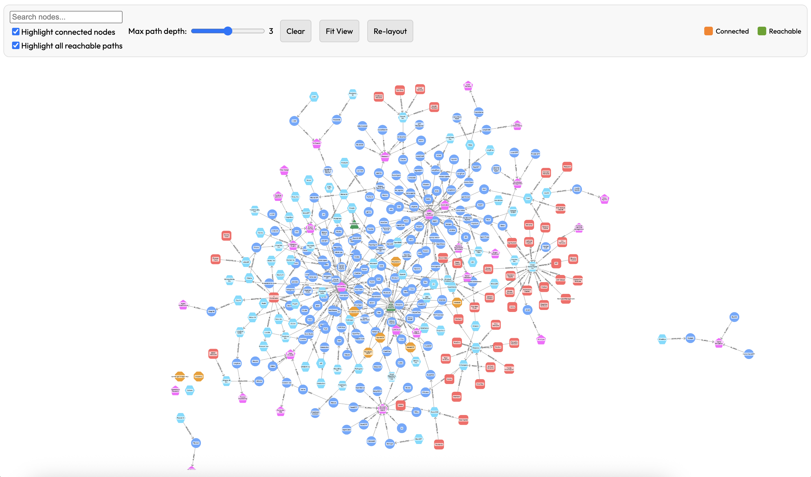
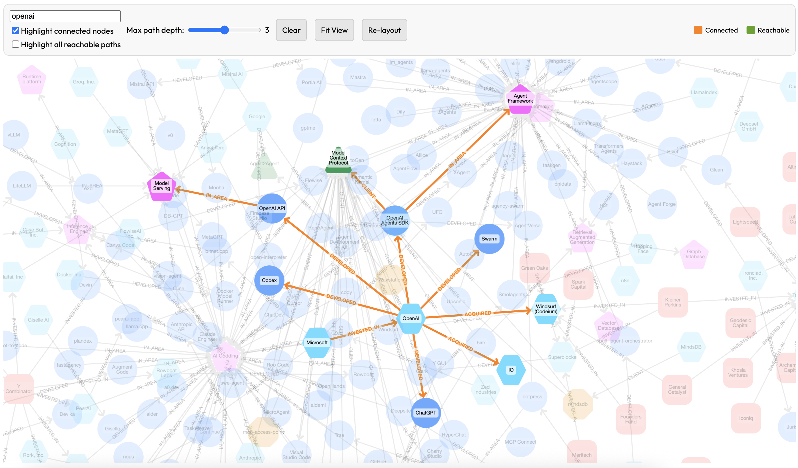
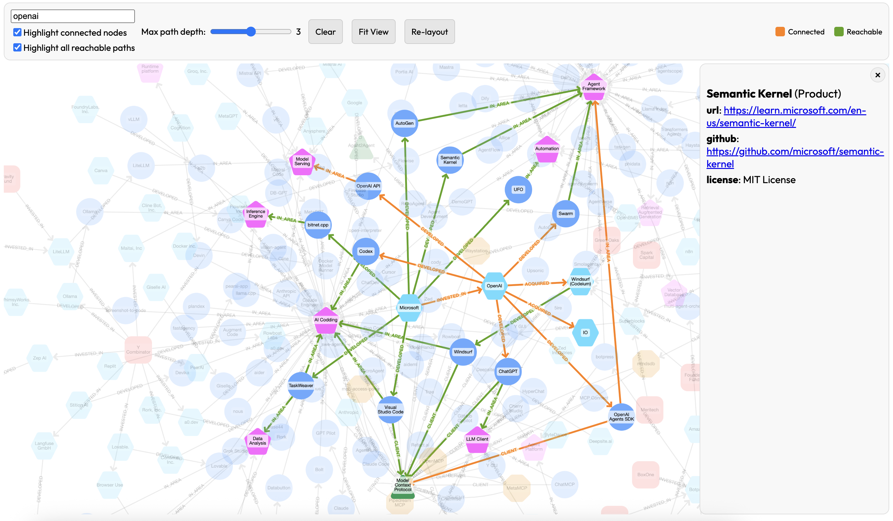
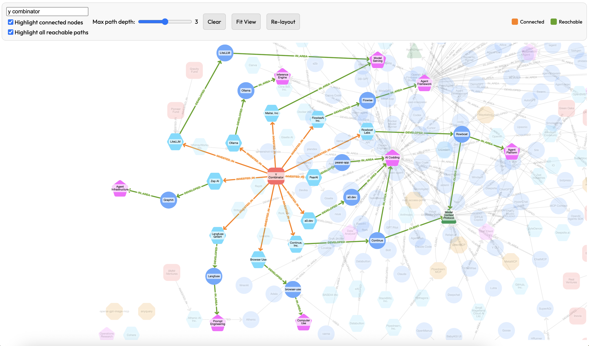
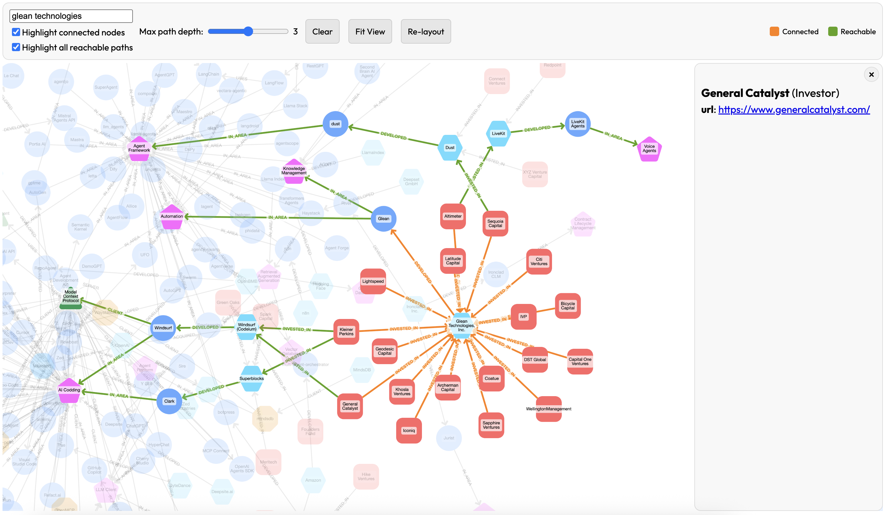
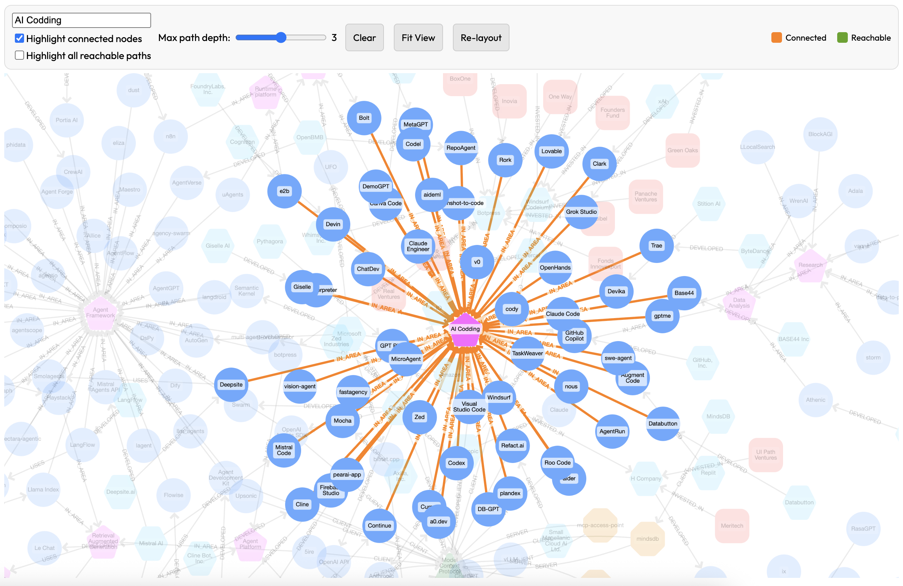

# Agent Landscape 

Holistic view on the current Generative AI application landscape including products, companies, use cases, investors and technologies related to AI agents. 

## Structure 

- `index.html` - visualization of the graph relation of data with products, use cases, companies, investors, protocols as nodes and their relations.
- `app.js` - embedded datasource and helper functions for visualization and searches for direct connection and most relevant paths.
- `js` - JS files for visualization of the data graph.
- `data.json` - Dataset file read by `app.js` for visualization.
- `show.sh` - The simplest local HTTP server to run the application on your system ( this can be modified to any other server )

## How to use the dataset 

### Basic view

### Search 

### Extended environment 

### Investor portfolio

### Startup investors

### Application Area

## Contributions 

We highly appreciate contributions in building the dataset by either direct updates or messages (or issues) related to needed fixes or updates. 

## License 

Agent Landscape Dataset (c) by AttoAgents

Agent Landscape Dataset is licensed under a
Creative Commons Attribution-ShareAlike 4.0 International License.

You should have received a copy of the license along with this
work. If not, see <https://creativecommons.org/licenses/by-sa/4.0/>.

## Attribution 

Agent Landscape Dataset by AttoAgents (https://attoagents.io).