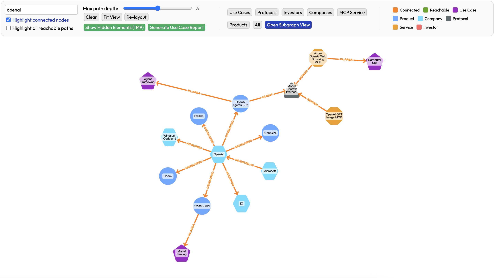
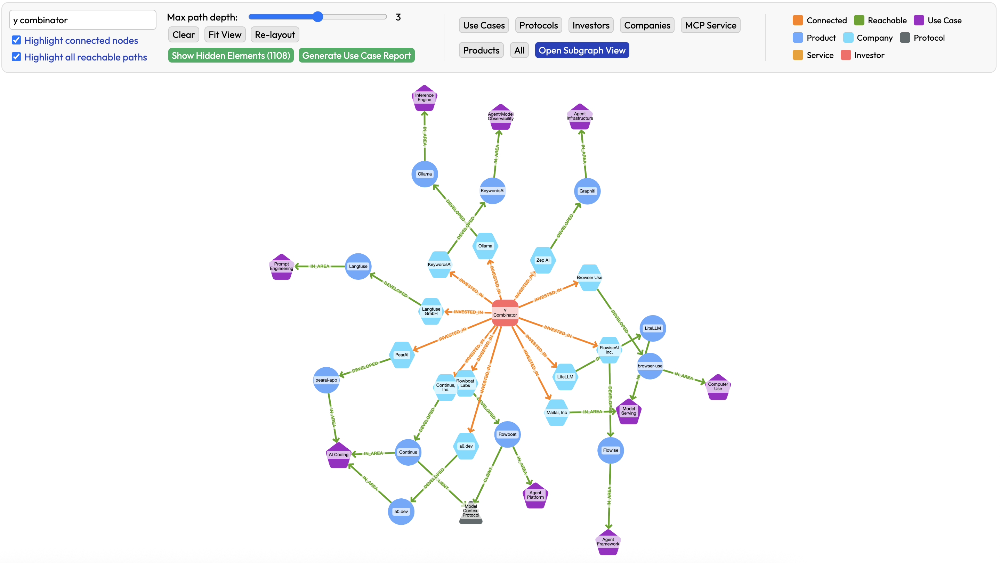
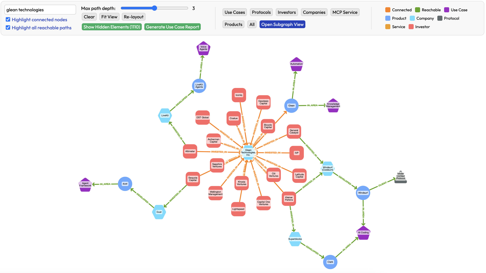

# Agent Landscape 

Holistic view on the current Generative AI application landscape including products, companies, use cases, investors and technologies related to AI agents. 

## Structure 

- `index.html` - Visualization of the graph relation of data with products, use cases, companies, investors, protocols as nodes and their relations.
- `app.js` - helper functions for visualization and searches for direct connection and most relevant paths.
- `data.json` - Dataset file read by `app.js` for visualization.
- `show.sh` - The simplest local HTTP server to run the application on your system ( this can be modified to any other server )
- `style.css` - CSS file with styles definition.
- `scripts` - Helper scripts for verifying the data, for example `verify-links.js` may be used for checking if links used in the data are correct.

## Data

The data is by far not complete and will be updated with new products, companies and related information on an ongoing basis.

## How to use the dataset 

The data is for the moment only provided in the JSON format and that file can be of course used directly to filter relevant information. The connections and interdependencies are however much better visible in the visualized graph format. The simple HTML+JS application (`index.html` and `app.js`) may be used to visualize the dataset and perform searches for nodes. 

Since the `data.json` is read dynamically, the application requires to be used with an HTTP server rather than by opening the `index.html` file. Any HTTP server may be used to serve the application and we include `show.sh` file that starts a simple python HTTP server. This file or any other HTTP server may be used to serve the directory containing the application files. 

We host the online version of this application with current version of the data at https://attoagents.io/landscape/ for convenience. The functionality of the online version and this repository may occasionally slightly differ. 

### Basic view

The main view of the data will include all nodes and all connections. Left part of the header of the page includes search box and  parameters that may be changed to include more/less connections.

Middle component of the navigation header includes buttons to filter the data and highlight all nodes of a given type, for example **Show Use Case** button will highlight all **Use Case** nodes and their direct connections and fade all other nodes and connections.

Right part includes the legend of colors used for edges and nodes of the visualized graph.

### Search 

### Extended environment 

### Investor portfolio

### Startup investors

### Application Area

### Predefined filters

## Contributions 

We highly appreciate contributions in building the dataset by either direct updates or messages (or issues) related to needed fixes or updates. 

## License 

Agent Landscape Dataset (c) by AttoAgents

Agent Landscape Dataset is licensed under a
Creative Commons Attribution-ShareAlike 4.0 International License.

You should have received a copy of the license along with this
work. If not, see <https://creativecommons.org/licenses/by-sa/4.0/>.

## Attribution 

Agent Landscape Dataset by AttoAgents (https://attoagents.io).