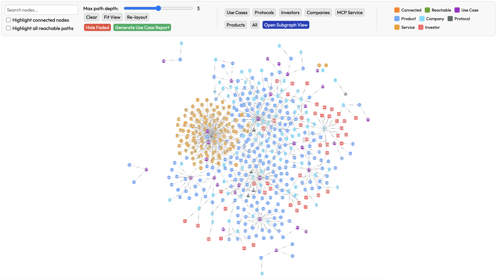
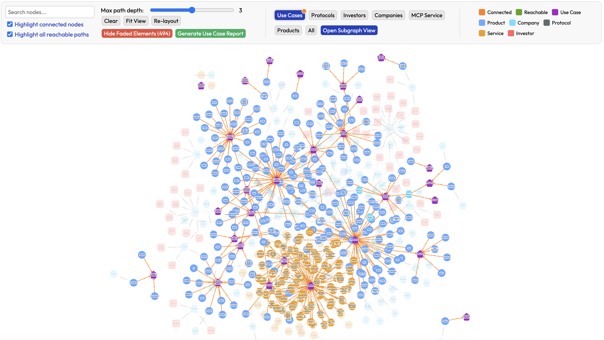

 

# Agent Landscape 

Holistic view on the current Generative AI application landscape including products, companies, use cases, investors and technologies related to AI agents. 

## Structure 

- `index.html` - Visualization of the graph relation of data with products, use cases, companies, investors, protocols as nodes and their relations.
- `app.js` - helper functions for visualization and searches for direct connection and most relevant paths.
- `data.json` - Dataset file read by `app.js` for visualization.
- `show.sh` - The simplest local HTTP server to run the application on your system ( this can be modified to any other server )
- `style.css` - CSS file with styles definition.
- `scripts` - Helper scripts for verifying the data, for example `verify-links.js` may be used for checking if links used in the data are correct.

## Data

The data is by far not complete and will be updated with new products, companies and related information on an ongoing basis.

## How to use the dataset 

The data is for the moment only provided in the JSON format and that file can be of course used directly to filter relevant information. The connections and interdependencies are however much better visible in the visualized graph format. The simple HTML+JS application (`index.html` and `app.js`) may be used to visualize the dataset and perform searches for nodes. 

Since the `data.json` is read dynamically, the application requires to be used with an HTTP server rather than by opening the `index.html` file. Any HTTP server may be used to serve the application and we include `show.sh` file that starts a simple python HTTP server. This file or any other HTTP server may be used to serve the directory containing the application files. 

We host the online version of this application with current version of the data at https://attoagents.io/landscape/ for convenience. The functionality of the online version and this repository may occasionally slightly differ. 

### Basic view

The main view of the data will include all nodes and all connections. Left part of the header of the page includes search box and  parameters that may be changed to include more/less connections.

Middle component of the navigation header includes buttons to filter the data and highlight all nodes of a given type, for example **Show Use Case** button will highlight all **Use Case** nodes and their direct connections and fade all other nodes and connections.

Right part includes the legend of colors used for edges and nodes of the visualized graph.

### Search 

Search field at the top left corner can be used to filter the graph to nodes that include search phrase in the node name. Two control switches are given below as **Highlight connected nodes** and **Highlight all reachable paths**. The first one will also display all nodes connected to the found nodes. The second will also include all nodes in paths that originate at the directly connected nodes following order of the connections. Both switches will include all node types. Direct connections will be highlighted in orange and reachable paths in green.

The image below shows search result for phrase *openai* which occurs several times in the name of the company and their products. All directly connected nodes are also highlighted and their connections marked in orange.

The extended environment of a given node is enabled with reachable paths. In the image below we use the same *openai* search phrase but enable the reachable paths. This for example includes paths originating from "Microsoft" as OpenAI's investor.

### Investor portfolio

Searching for a node that represents an investor displays the portfolio of the companies that this particular organization supported. An extended paths will also lead to products and application areas in which this investment effectively took place.

On the image below we search phrase *y combinator* and get highlighted subgraph of central node as the investor with the portfolio companies connected to it. Reachable paths lead to products and application areas.

### Startup investors

An inverse information to the above example may be obtained by searching for a company. The list of known investor nodes are highlighted after the search. The reachable paths in this case lead to other investments from a given investor node.

On the example below we show search for phrase *glen technologies* which highlights the company and their investor list. Reachable paths here show similar investments, sometimes by several funds.

After clicking on the node a panel with detailed properties of this node will be open on the right side of the window.

### Application Area

Search for an application area (use case) highlights all products that are related to this area. In the example below we use *AI coding* to display list of all products related to the AI assisted or automated coding.

### Predefined filters

Predefined filters present in the middle section of the top panel highlight all nodes of particular type and all their direct connections. This is present for **Use Case**, **Protocol**, **Investor**, **Company**, **Service** (special case of product related to MCP services), and **Product**. 

The example below displays all use cases and the products related to them.

### Subgraphs and tabular data

Top navigation middle section includes button **Open Subgraph View** which can be used together with any filter buttons. After selecting for example **Use Case**, a filter will be set to include all use case nodes. After using **Open Subgraph View** a modal will be open that will include table view of all nodes of the selected type. In case of **Use Case**, this will be a table of all application areas. 

The presented table includes all entries for a given node type and each of them lists a **View** button. Using it present a detailed view of the selected node with a table including details on the left and subgraph on the right. 

**View All Connections** button can be used to switch from the summary of the central node to the list of connections.

Alternatively a click on the node or item on the list of subgraph nodes (from previous step), will display details of the selected node (for example details of the central node).

## Contributions 

We highly appreciate contributions in building the dataset by either direct updates or messages (or issues) related to needed fixes or updates. 

## License 

Agent Landscape Dataset (c) by AttoAgents

Agent Landscape Dataset is licensed under a
Creative Commons Attribution-ShareAlike 4.0 International License.

You should have received a copy of the license along with this
work. If not, see <https://creativecommons.org/licenses/by-sa/4.0/>.

## Attribution 

Agent Landscape by AttoAgents (https://attoagents.io).